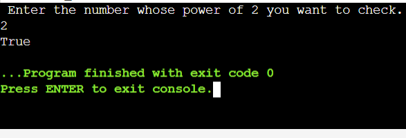
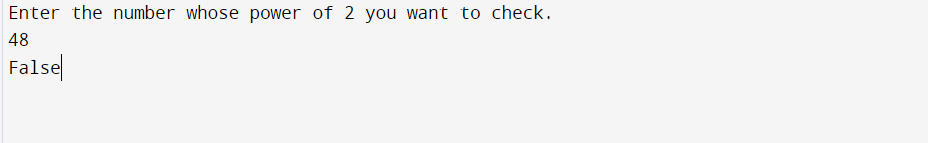

# -TJ-Tasks-2022-Amal-P

#

EASY - POWER OF 2 

Approach - To take a number n and dividing by 2 , storing in n itself, unless n=1

```
#include <stdio.h>
int main() 
{
    int n; char ch;
    printf(" Enter the number whose power of 2 you want to check.\n");
    scanf("%d",&n);
     while(n%2==0)
    {
        n/=2;
    }
if(n==1)
    printf("True");
else
    printf("False");
return 0;
}
```



